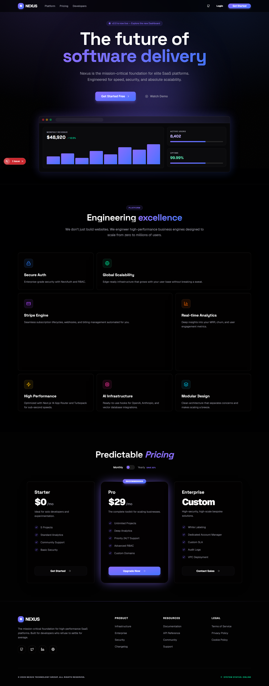
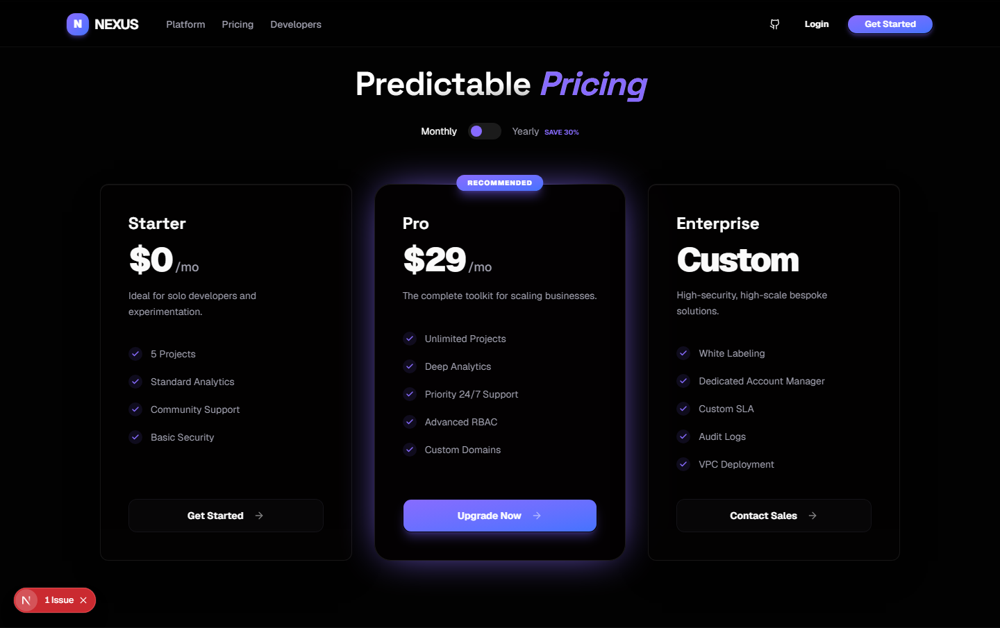
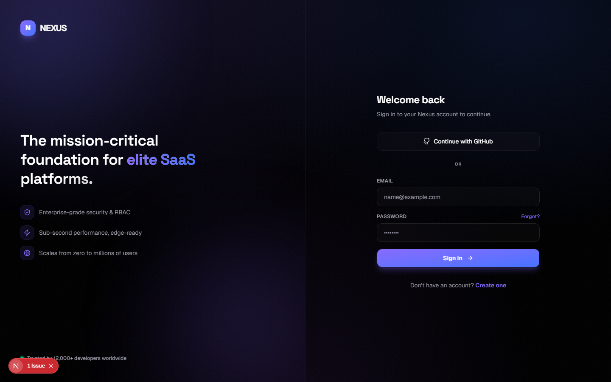
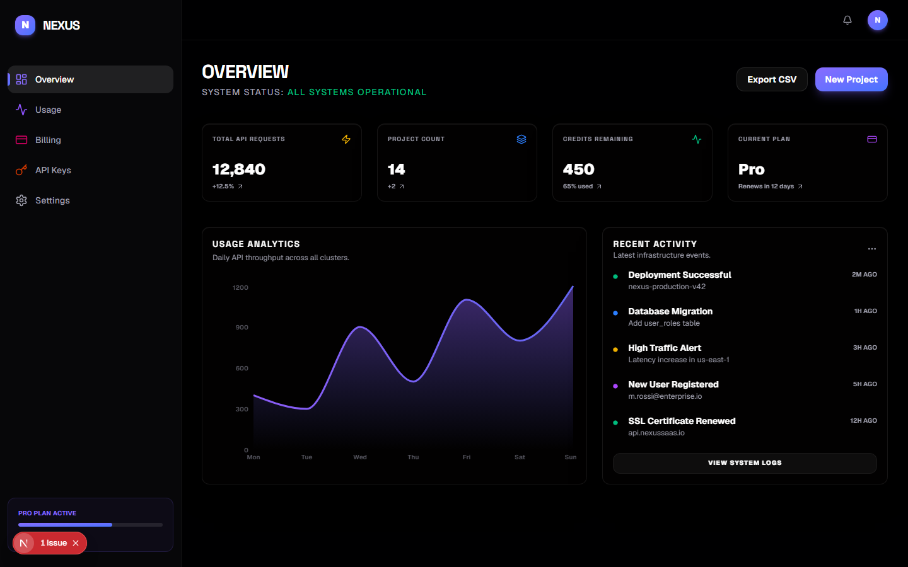
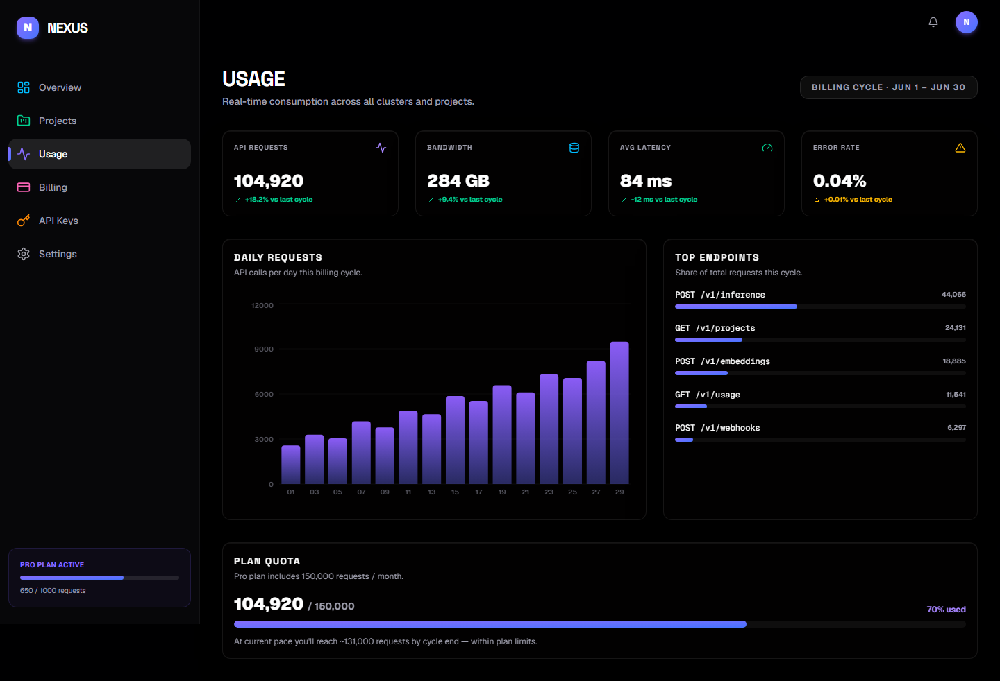
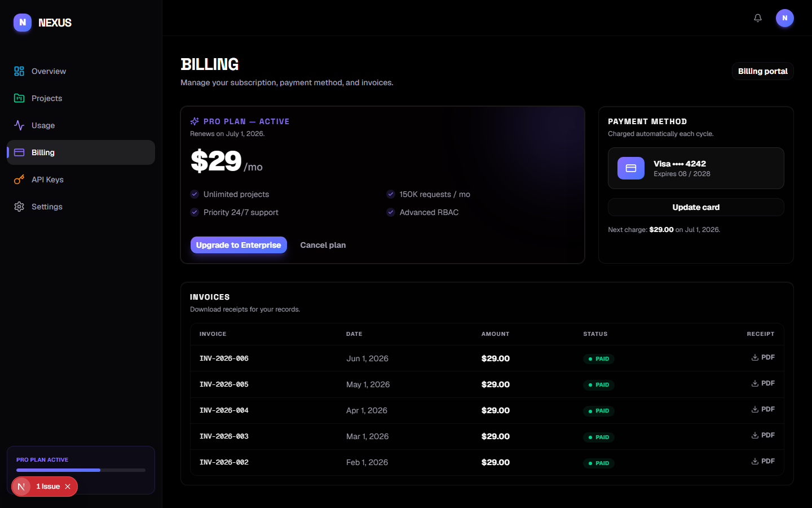
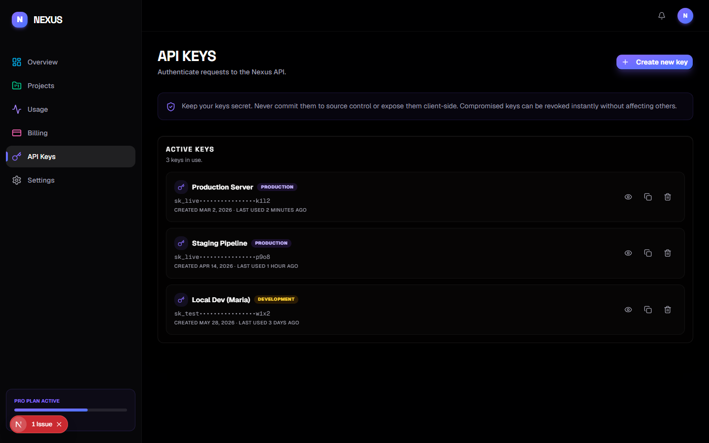
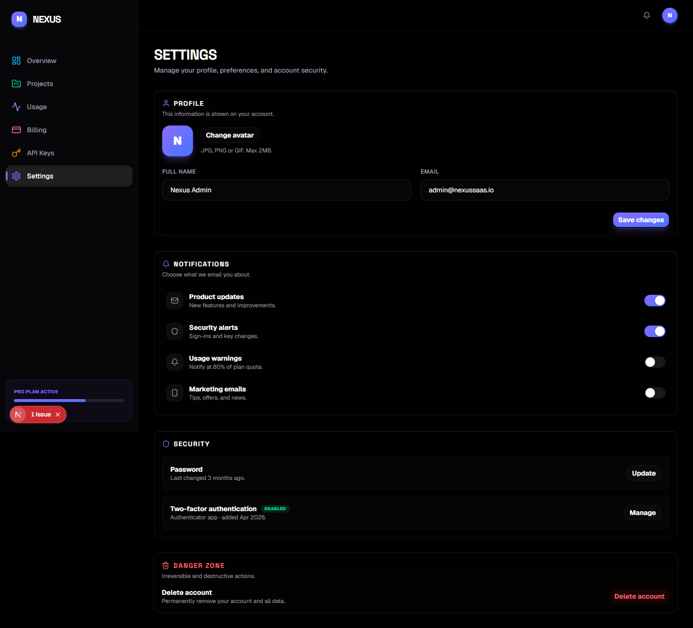

<div align="center">

# Nexus

### The mission-critical foundation for modern SaaS platforms

A full-stack SaaS starter with a branded marketing site, authentication, and a complete product dashboard — built with **Next.js 16**, **React 19**, **TypeScript**, **Prisma**, and **Stripe**.

<br />



<p>
  
  
  
  
  
  
</p>

</div>

---

## Overview

Nexus is a polished, end-to-end SaaS boilerplate designed around a cohesive **electric violet → indigo** design system. It demonstrates a complete product surface — from a high-conversion marketing landing page, through authentication, into a fully built-out analytics dashboard — all sharing one dark, glassmorphic visual language.

## ✨ Features

- **Branded marketing site** — animated hero, bento-grid feature section, monthly/yearly pricing toggle, and footer.
- **Authentication** — login & register flows on a branded split-screen layout, powered by NextAuth (credentials + Prisma adapter) with a GitHub SSO entry point.
- **Complete dashboard** — six fully designed views:
  - **Overview** — KPI cards, area chart, and an activity feed.
  - **Usage** — daily-request bar chart, top-endpoint breakdown, and plan-quota tracking.
  - **Billing** — active plan, payment method, and an invoice history table.
  - **API Keys** — interactive key management with reveal / copy / revoke.
  - **Settings** — profile editor, notification toggles, security, and a danger zone.
  - **Projects** — project cards with status, search, and an empty-state.
- **Design system** — custom OKLCH color tokens, reusable `glass` utilities, a brand gradient, a display typeface, and subtle texture — all dark-mode-first.
- **Smooth motion** — entrance and hover animations throughout via Framer Motion.

## 🛠 Tech Stack

| Layer | Technology |
|-------|------------|
| Framework | [Next.js 16](https://nextjs.org/) (App Router, Turbopack) |
| UI | [React 19](https://react.dev/), [TypeScript](https://www.typescriptlang.org/) |
| Styling | [Tailwind CSS v4](https://tailwindcss.com/), [Base UI](https://base-ui.com/) (shadcn-style components) |
| Animation | [Framer Motion](https://www.framer.com/motion/) |
| Charts | [Recharts](https://recharts.org/) |
| Icons | [Lucide](https://lucide.dev/) |
| Auth | [NextAuth.js](https://next-auth.js.org/) |
| Database | [PostgreSQL](https://www.postgresql.org/) + [Prisma ORM](https://www.prisma.io/) |
| Payments | [Stripe](https://stripe.com/) |
| Notifications | [Sonner](https://sonner.emilkowal.ski/) |

## 📸 Screenshots

| Pricing | Authentication |
|---------|----------------|
|  |  |

| Dashboard — Overview | Usage |
|----------------------|-------|
|  |  |

| Billing | API Keys |
|---------|----------|
|  |  |

<details>
<summary>More screenshots</summary>

### Settings


</details>

## 🏁 Getting Started

### Prerequisites
- Node.js 18+
- A PostgreSQL database

### 1. Clone & install
```bash
git clone https://github.com/killingspree001/nexus-saas.git
cd nexus-saas
npm install
```

### 2. Configure environment
Copy the example file and fill in your own values:
```bash
cp .env.example .env
```
| Variable | Purpose |
|----------|---------|
| `DATABASE_URL` | PostgreSQL connection string |
| `NEXTAUTH_URL` / `NEXTAUTH_SECRET` | NextAuth session config |
| `GOOGLE_CLIENT_ID` / `GOOGLE_CLIENT_SECRET` | OAuth (optional) |
| `STRIPE_SECRET_KEY` / `STRIPE_WEBHOOK_SECRET` / `NEXT_PUBLIC_STRIPE_PUBLISHABLE_KEY` | Billing |
| `RESEND_API_KEY` / `EMAIL_FROM` | Transactional email |

### 3. Set up the database
```bash
npx prisma generate
npx prisma db push
```

### 4. Run
```bash
npm run dev
```
Open [http://localhost:3000](http://localhost:3000).

## 📁 Project Structure

```
src/
├── app/
│   ├── (auth)/            # login & register
│   ├── (dashboard)/       # dashboard, usage, billing, api-keys, settings, projects
│   ├── api/               # auth & register route handlers
│   ├── globals.css        # design tokens & utilities
│   └── page.tsx           # marketing landing
├── components/
│   ├── auth/              # AuthShell
│   ├── dashboard/         # Sidebar, PageHeader
│   ├── landing/           # Hero, Features, Pricing, Navbar, Footer
│   └── ui/                # Base UI primitives (button, card, input, ...)
└── lib/                   # auth, prisma, stripe, utils
prisma/
└── schema.prisma          # User, Project, Subscription, Usage, ...
```

## 📌 Project Status

This is a **front-end-complete** showcase. The marketing site, auth flows, and full dashboard UI are built and interactive. The dashboard currently renders representative **demo data**; the Prisma schema, Stripe, and email layers are scaffolded and ready to be wired to live data. Planned next steps:

- [x] Branded landing page & design system
- [x] Auth flows (login / register)
- [x] Full dashboard UI (overview, usage, billing, API keys, settings, projects)
- [ ] Connect dashboard to live database queries
- [ ] Stripe checkout & webhook automation
- [ ] Route protection for dashboard pages

## 📄 License

Released under the [MIT License](LICENSE).

---

<div align="center">
Built by <a href="https://github.com/killingspree001">killingspree001</a>
</div>
